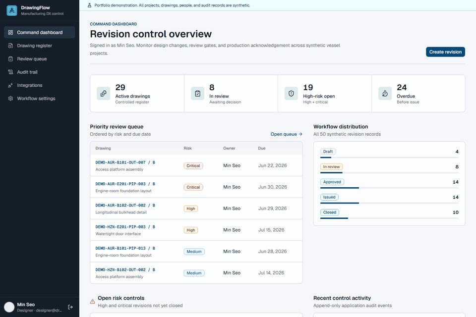
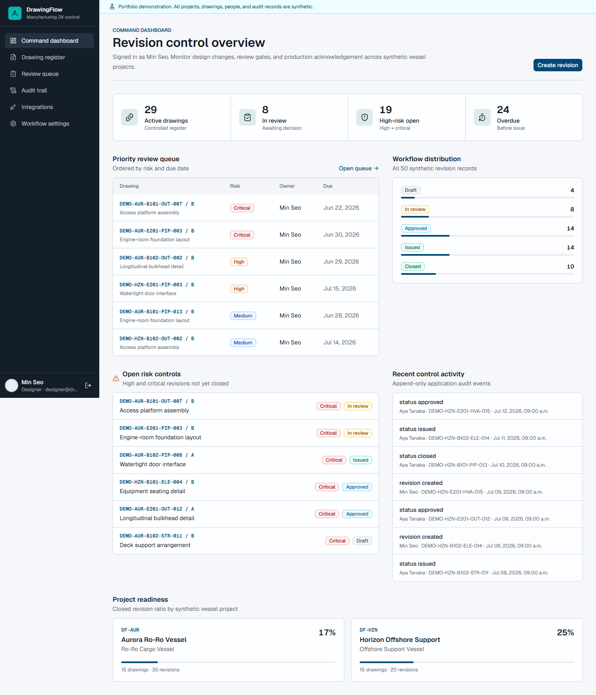
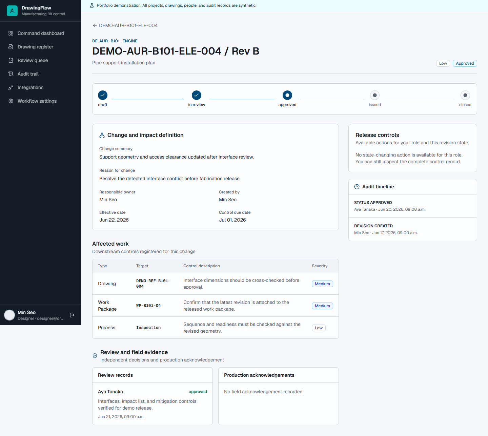
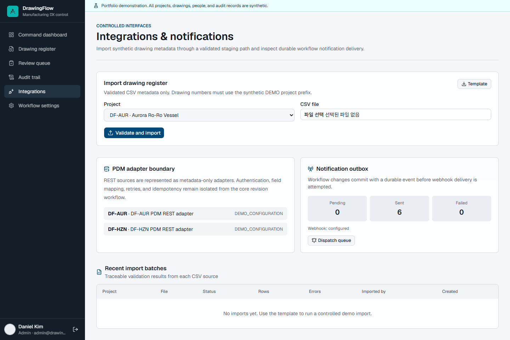
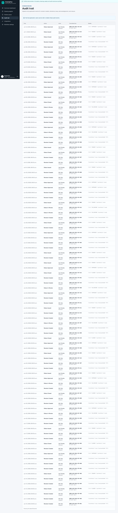

# DrawingFlow

[](https://github.com/jiwonjae-svg/drawing-revision-impact-tracker/actions/workflows/ci.yml)
[Live demo](https://drawing-revision-impact-tracker.vercel.app) · [Two-minute walkthrough](docs/DEMO_WALKTHROUGH.md)

DrawingFlow is a portfolio-grade **Drawing Revision Impact Tracker** for ship design and manufacturing DX workflows. It controls a drawing change from draft through independent review, approved issue, production acknowledgement, and closure.

> **Data disclaimer:** every project, drawing number, person, work package, status event, and audit record in this repository is synthetic. No employer, customer, vessel, or production drawing data is included.



## Why this project exists

Drawing revisions do not affect a drawing alone. They can change fabrication sequence, work-package readiness, interfaces, material decisions, inspection scope, and delivery risk. DrawingFlow makes those downstream effects visible before an approved revision reaches production.

## Controlled workflow

```text
Draft -> In Review -> Approved -> Issued -> Closed
             |                         |
             +----> Draft              +--> Production acknowledgement required
```

Release gates:

- A draft requires a change summary and at least one impact item before review.
- High and critical revisions require a responsible owner and mitigation plan.
- A creator cannot approve their own revision.
- Issue requires an approval record and effective date.
- Closure requires a production acknowledgement.
- Every mutation writes an audit event in the same transaction; a PostgreSQL trigger rejects later updates or deletes.

## Product surface

- Command dashboard for pending review, overdue control work, and open risk
- Drawing register with search, filter, sort, detail history, and CSV export
- Revision creation with downstream impact registration
- Role-aware review, approval, rejection, issue, acknowledgement, and close actions
- Risk-ordered review queue
- Revision-level evidence timeline and global audit trail
- Project-scoped memberships and role authorization on reads and mutations
- Validated CSV drawing-register import with batch-level error evidence
- Typed REST PDM adapter boundary with upstream response validation
- Durable notification outbox with webhook delivery and retry state
- Read-only workflow, security posture, and role capability matrix

## Evidence screens

| Revision control dashboard | Revision impact evidence |
|---|---|
|  |  |

| Controlled integrations | Append-only audit trail |
|---|---|
|  |  |

## Demo roles

All demo accounts use `Demo123!`.

| Role | Account | Primary capability |
|---|---|---|
| Designer | `designer@drawingflow.demo` | Create and submit revisions |
| Reviewer | `reviewer@drawingflow.demo` | Approve, return, and issue |
| Production | `production@drawingflow.demo` | Acknowledge and close |
| Admin | `admin@drawingflow.demo` | Manage the full workflow |
| Viewer | `viewer@drawingflow.demo` | Read-only inspection |

## Architecture

- **UI:** Next.js 16 App Router, React 19, TypeScript, Tailwind CSS 4, shadcn/ui
- **Data:** PostgreSQL 16, Prisma 7 with PostgreSQL driver adapter
- **Authentication:** Auth.js credentials flow with bcrypt/JWT plus optional approved-member Google or GitHub SSO
- **Authorization:** Project membership and project-specific roles applied in the data-access and mutation layers
- **Validation:** Zod plus `csv-parse` for bounded, row-level import validation
- **Integration:** Transactional import batches, typed REST PDM contract, and webhook notification outbox
- **Testing:** Vitest for workflow, export, CSV, and PDM rules; Playwright for multi-role, project isolation, import, and responsive flows

## Integration boundaries

### PDM metadata adapter

The implemented adapter is deliberately vendor-neutral and metadata-only. It calls `drawings/changes`, sends a bearer token, requests pages of at most 500 records, uses an eight-second timeout and `no-store` caching, and validates every upstream response before it reaches the revision workflow.

Implemented metadata contract:

| Upstream field | DrawingFlow meaning |
|---|---|
| `id` | Stable external record identity |
| `number` | Controlled drawing number |
| `title` | Human-readable drawing title |
| `revision` | External revision code |
| `changedAt` | Source-system change timestamp |
| `lifecycleState` | Source lifecycle or release state |
| `nextCursor` | Bounded incremental synchronization cursor |

For an Aras Innovator or equivalent production adapter, the next implementation step would map ItemTypes and lifecycle states, authenticate with the organization's approved OAuth/session method, resolve change-item and EBOM/MBOM relationships, and persist idempotency checkpoints. Those vendor-specific connections are **not** claimed as implemented here; the repository provides the typed boundary and validation rules they would plug into.

### Notification outbox and demo receiver

Workflow mutations and notification events commit in the same database transaction. Dispatch processes a bounded batch, records attempts, marks successful deliveries `SENT`, and schedules failed deliveries for retry. The included `/api/demo/notifications` receiver:

- requires a shared secret and compares it in constant time;
- rejects payloads larger than 16 KiB;
- accepts only a strict DrawingFlow event schema with `synthetic: true`;
- returns `204` without persisting the inbound demonstration payload.

This receiver proves the delivery path without introducing a third-party service or storing customer data.

The application uses a server-only data access layer under `src/data`. Every server action authenticates the caller, checks project membership and role, validates input, reevaluates the workflow gate, and writes its data change, audit event, and notification event in one database transaction.

## Local setup

Prerequisites: Node.js 20+, npm, Docker Desktop, and Chrome.

```bash
npm install
docker compose up -d
npm run db:migrate
npm run db:seed
npm run dev -- -p 3200
```

Open `http://127.0.0.1:3200`.

## Verification

```bash
npm run lint
npm test
npm run test:db
npm run build
npm run test:e2e
npm run demo:capture
npm run demo:outbox:verify
npm run demo:webhook:verify
```

The automated suite currently covers 20 unit/integration assertions, four Playwright scenarios across desktop and mobile, and a direct database check that confirms audit rows cannot be updated or deleted. GitHub Actions runs the same checks against PostgreSQL 16 on every push and pull request.

The project uses Webpack for Next.js development and production builds because the current Turbopack release has a Windows Unicode-path panic when the repository lives below a Korean-named directory.

## Production deployment

Use a managed PostgreSQL database and set:

```text
DATABASE_URL=postgresql://...
AUTH_SECRET=<strong-random-secret>
AUTH_TRUST_HOST=true
NEXT_PUBLIC_APP_NAME=DrawingFlow
NOTIFICATION_WEBHOOK_URL=https://...
NOTIFICATION_WEBHOOK_SECRET=<independent-random-secret>
```

Run `prisma migrate deploy` during release. Optional Google or GitHub SSO is activated only when its client ID and secret are present, and only pre-approved member emails are accepted. Credentials remain enabled for the public role-based portfolio walkthrough.

## Known boundaries

- This MVP tracks impact metadata rather than storing confidential CAD files.
- The REST PDM adapter is a tested integration contract; no proprietary PDM endpoint or CAD binary is connected.
- Webhook delivery and a secured synthetic demo receiver are implemented; events remain queued when `NOTIFICATION_WEBHOOK_URL` is absent.
- A production owner should additionally configure retention policy, database roles, secret rotation, alerting, and organization-specific SSO.
- ERP work-package synchronization and CAD-file preview are future work and are not claimed as implemented.
